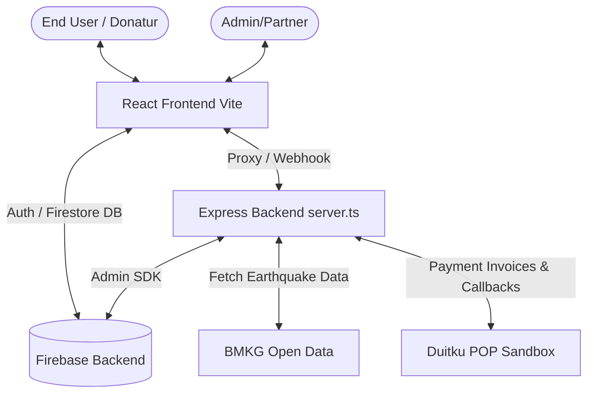

# Architecture Overview

## Tech Stack

- **Frontend:** React, Vite, TailwindCSS, TypeScript
- **Backend:** Express (Node.js, TypeScript)
- **Database:** Firebase Firestore
- **Authentication:** Firebase Auth (Client) + Custom staff session
- **Payment Gateway:** Duitku

## System Architecture

## Application Modules

### 1. Data Ingestion (BMKG)
- Frontend manually triggers a fetch via backend proxy `/api/bmkg/*`.
- Backend pulls JSON from BMKG and proxies it back to the client.
- Frontend formats data to `Disaster` and pushes to Firestore with `pending_verification`.

### 2. Verification & Partner Assignment
- Admin accesses the dashboard and sees pending disasters.
- **Rule Engine**: All automated logic has been stripped.
- Admin must select an active **Mitra Lapangan** (Partner) from Firestore and manually approve.
- Approved disasters are marked `admin_approved` and appear on the donor dashboard.

### 3. Donation & Payments
- Donors select an `admin_approved` disaster and create a Donation in Firestore.
- Frontend calls backend `/api/duitku/createInvoice` to get a payment URL / QR string.
- Duitku processes the payment and sends a server-to-server callback to `/api/duitku/callback`.
- Backend uses Firebase Admin SDK to update `payments` and `donations` to `paid`.

### 4. Distribution & Tracking
- Admin creates `Disbursement` to Partners.
- Partners log into the Partner Portal to acknowledge receipt and update `DistributionMilestones`.
- `TrackingEvents` are strictly isolated by donor ID in Firestore rules, but Partners/Admins can write updates that cascade to individual donor timelines.

## Security Posture
- **Firestore Rules**: Protects PII by ensuring users can only read/write their own donations. Admin and Partner roles have elevated but strictly verified access.
- **Environment Variables**: No sensitive backend keys are exposed to Vite.
- **Idempotency**: Duitku callbacks are resilient against duplicate requests.
